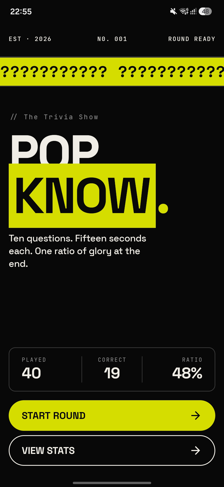
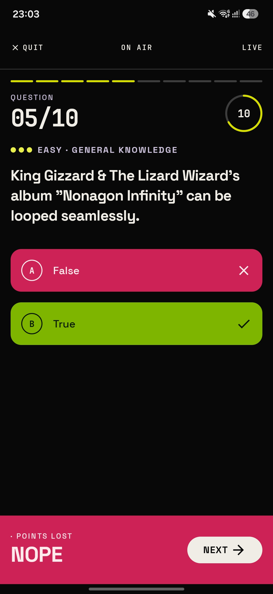
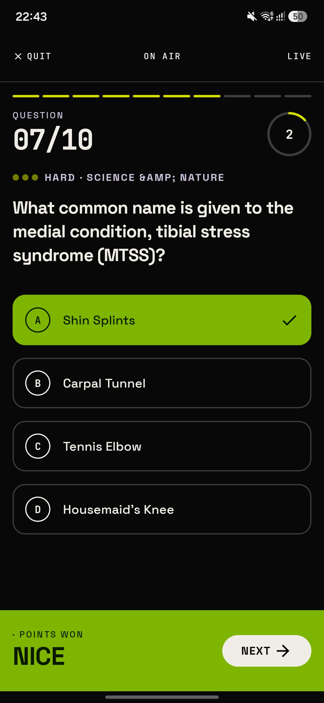
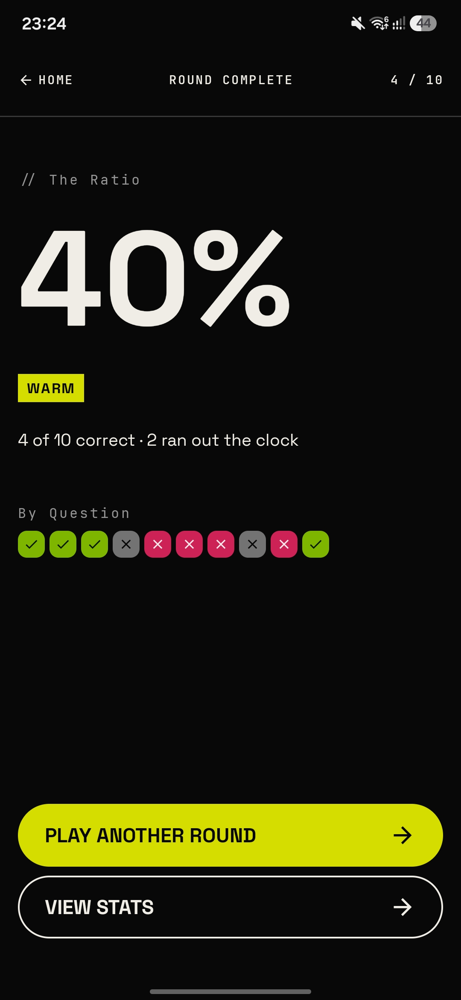
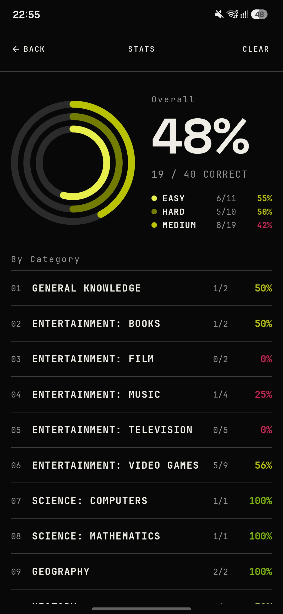

# 🧠 PopKnow
**PopKnow** is a KMP/CMP trivia quiz application pulling questions across all categories from the Open Trivia Database — entertainment-heavy (music, movies, anime, comics, board games) but unfiltered, so general knowledge and other topics show up too. Built with **Compose Multiplatform**, **Kotlin Multiplatform**, and **Clean Architecture**, the app tracks per-answer history locally and surfaces accuracy statistics across sessions.

The primary goal of PopKnow is **not the app itself** — it is a living architecture reference codebase. Every decision is deliberate and codified, with a strict separation between MVI state, domain models, and render targets enforced at compile-test time via Konsist.

---

## ✨ Features

- 🏠 **Home**
    - Lifetime accuracy summary, shown only once history exists
    - Entry point to a new quiz or full stats history

- 🎮 **Play**
    - 10-question quiz sourced from the Open Trivia Database
    - 15-second per-question timer with automatic timeout handling
    - Immediate per-answer persistence — no batch save, no game-end write

- 🏆 **Result**
    - Game outcome reconstructed from persisted answers, not in-memory navigation state
    - No shared state or navigation arguments required between Play and Result

- 📊 **Stats**
    - Full history breakdown: total answered, total correct, accuracy
    - Per-category and per-difficulty aggregation

---

## 🖼️ Showcase

        

---

## 🧱 Tech Stack

### 🧩 Architecture
- Clean Architecture (Data, Domain, Presentation layers)
- MVI with MVIKotlin (StoreFactory, Executor, Reducer pattern)
- UseCase-driven domain interaction, with use cases reserved for logic that crosses a port — pure transitions stay as domain methods
- Each repository correctly juggles a remote (Ktor) and local (SQLDelight) data source, with neither leaking past the repository boundary
- Konsist for structural architecture enforcement, organized by rule category rather than by layer

### 🛠 Libraries
- [Compose Multiplatform](https://www.jetbrains.com/lp/compose-multiplatform/) — shared UI for Android and iOS
- [Kotlin Multiplatform](https://kotlinlang.org/docs/multiplatform.html)
- [MVIKotlin](https://arkivanov.github.io/MVIKotlin/) — MVI framework
- [Koin](https://insert-koin.io/) — dependency injection
- [Navigation 3](https://developer.android.com/guide/navigation/navigation-3) — KMP-compatible artifacts, with type-safe `NavKey` destinations
- [Ktor](https://ktor.io/) — remote data source, fetching questions and categories from the Open Trivia Database
- [SQLDelight](https://cashapp.github.io/sqldelight/) — local data source, per-answer persistence and history queries
- [Compose Multiplatform resources](https://www.jetbrains.com/help/kotlin-multiplatform-dev/compose-multiplatform-resources.html) — shared strings, drawables, and fonts across platforms
- [Konsist](https://docs.konsist.lemonappdev.com/) — architecture test enforcement
- [ktlint](https://pinterest.github.io/ktlint/) + [ktlint-compose-rules](https://mrmans0n.github.io/compose-rules/)

---

## 📁 Project Structure

```
shared/
├── app/
│   ├── App.kt
│   ├── design/
│   │   ├── component/               # App-wide reusable composables
│   │   └── theme/                   # Design tokens, color palettes, spacing
│   ├── di/
│   │   ├── KoinInit.kt
│   │   └── AppModule.kt
│   └── navigation/
│       ├── impl/
│       │   ├── HomeNavigatorImpl.kt
│       │   ├── QuizNavigatorImpl.kt
│       │   └── StatsNavigatorImpl.kt
│       ├── NavConfig.kt
│       └── NavigationModule.kt
├── common/                          # Cross-cutting domain concepts
│   ├── error/                       # AppError / AppException, single throw-catch mechanism
│   └── trivia/                      # Category, Difficulty, QuestionType — shared across features
├── feature/
│   ├── home/
│   ├── quiz/
│   │   ├── data/
│   │   │   ├── datasource/
│   │   │   │   ├── local/
│   │   │   │   │   ├── mapper/
│   │   │   │   │   │   └── QuizLocalMapper.kt
│   │   │   │   │   ├── QuizLocalDataSource.kt
│   │   │   │   │   └── QuizLocalDataSourceImpl.kt
│   │   │   │   └── remote/
│   │   │   │       ├── api/
│   │   │   │       │   ├── QuizApi.kt
│   │   │   │       │   └── QuizApiImpl.kt
│   │   │   │       ├── dto/
│   │   │   │       │   ├── CategoryDto.kt
│   │   │   │       │   ├── CategoryResponseDto.kt
│   │   │   │       │   ├── TriviaQuestionDto.kt
│   │   │   │       │   └── TriviaResponseDto.kt
│   │   │   │       ├── mapper/
│   │   │   │       │   └── QuizRemoteMapper.kt
│   │   │   │       ├── QuizRemoteDataSource.kt
│   │   │   │       └── QuizRemoteDataSourceImpl.kt
│   │   │   ├── repository/
│   │   │   │   └── QuizRepositoryImpl.kt
│   │   │   └── di/
│   │   ├── domain/
│   │   │   ├── model/
│   │   │   │   ├── AnsweredQuestionResult.kt
│   │   │   │   ├── AnswerStatus.kt
│   │   │   │   ├── GameResult.kt
│   │   │   │   ├── QuestionProgress.kt
│   │   │   │   ├── QuizSession.kt
│   │   │   │   └── TriviaQuestion.kt
│   │   │   ├── repository/
│   │   │   │   └── QuizRepository.kt
│   │   │   └── usecase/
│   │   │       ├── GetLastGameResultUseCase.kt
│   │   │       ├── StartQuizUseCase.kt
│   │   │       └── SubmitAnswerUseCase.kt
│   │   └── presentation/
│   │       ├── navigation/
│   │       │   ├── QuizDestination.kt
│   │       │   ├── QuizNavigator.kt
│   │       │   └── QuizNavKeyHandler.kt
│   │       └── screen/
│   │           ├── quiz/
│   │           │   ├── QuizContract.kt
│   │           │   ├── QuizRoute.kt
│   │           │   ├── QuizScreen.kt
│   │           │   ├── QuizScreenPreview.kt
│   │           │   ├── QuizStoreFactory.kt
│   │           │   ├── QuizUiMapper.kt
│   │           │   ├── QuizUiModel.kt
│   │           │   └── QuizViewModel.kt
│   │           └── result/          # sibling screen within the quiz feature
│   └── stats/
└── infra/
    ├── database/                    # SQLDelight driver setup
    ├── mvi/                         # MVIKotlin base wiring
    ├── navigation/                  # AppNavigator, NavKeyHandler, NavGraph
    ├── network/                     # Ktor client configuration
    ├── platform/                    # expect/actual platform utilities
    └── ui/                          # AppError UI resolution, InitialLoad, shared UI utilities
konsist/                             # Separate module, sibling of shared/, architecture enforcement tests
```

---

## 🏛 Architecture Decisions

### Package structure
Four top-level packages:
- `app/` — PopKnow-specific composition: `App.kt`, the design system (`design/component`, `design/theme`), root DI aggregation, and the navigator implementations that wire features together.
- `infra/` — reusable technical plumbing with no domain or feature knowledge: database driver setup, the MVI base wiring, the root nav graph (`AppNavigator`, `NavKeyHandler`), network client configuration, platform abstractions.
- `common/` — cross-cutting domain concepts shared across features (`AppError`/`AppException`, shared trivia vocabulary like `Category`/`Difficulty`/`QuestionType`).
- `feature/` — vertical feature slices, each owning its full `data/domain/presentation` stack.

### Domain layer conventions
- Domain models are pure values with pure transition functions — no `Flow`/`StateFlow`, no internal mutability. A domain object's job is to be true independent of any screen, platform, or lifecycle.
- `*UseCase` is reserved for logic that touches a port (a repository, a clock, anything with a managed lifecycle) or coordinates more than one step. A use case that would just forward to a single pure domain method doesn't exist — the domain method is called directly.
- SQLDelight table and column names stay plain (no `*Entity` suffix) — that convention belongs to Room, not SQLDelight. Generated SQLDelight types are mapped straight to domain in `local/mapper`, no intermediate entity layer.
- Enum-to-primitive and primitive-to-enum conversions (DB string representations, etc.) are plain top-level functions named after their destination type (`toQuestionType`, `toDbValue`), not layer-suffixed — the return type already disambiguates the layer.

### Presentation layer conventions
Screen folders contain exactly:
- `*Contract.kt` — exactly five top-level declarations: `*Intent`, `*Label`, `*Action`, `*Message`, `*State`. Nothing else lives in this file.
- `*UiModel.kt` — the render target the Composable reads. No domain types as field types — only primitives, enums, and other UiModel types.
- `*UiMapper.kt` — derivation from `*State` to `*UiModel` lives here, kept out of both the Composable and the executor.
- `*ScreenPreview.kt` — `PreviewParameterProvider` implementations construct `*UiModel` instances directly, never `*State` — previews describe what the screen should render, not what the Store operates on.
- `Route.kt` / `Screen.kt` / `StoreFactory.kt` / `ViewModel.kt` — same responsibilities as the MVI convention below.

The boundary is enforced at the Composable's input type: `*Screen.kt` only ever reads `*UiModel`, never `*State`, never a domain type directly. `*State` is free to hold domain objects and presentation primitives — it's a screen-logical container, not a layer-typed one.

### MVI conventions
- `*Intent` — user-initiated events from the UI
- `*Label` — one-shot side effects (navigation, toasts)
- `*Action` — bootstrapper-initiated internal triggers
- `*Message` — reducer input, produced by the executor
- `*State` — immutable, screen-logical state snapshot; the input the reducer reads and writes, not the shape Compose renders

### Navigation (Navigation 3)
Built on KMP-compatible Navigation 3 artifacts, with a navigator abstraction so cross-feature wiring never leaks into a feature itself:
- Each feature defines its own `*Navigator` interface and `*NavKeyHandler` — a feature only ever knows its own destinations, never another feature's `NavKey`.
- `app/navigation/impl/` holds the concrete `*NavigatorImpl` classes that wire features together — the only place allowed to know about more than one feature's destinations at once.
- `infra/navigation/` owns the feature-agnostic plumbing (`NavGraph`, `NavConfig`) with zero feature imports.

### Error handling
- `AppError` is a single sealed interface; `AppException` is the only throw/catch mechanism. Generic exceptions are caught and translated to a typed `AppError` once, at the point where they first cross from infrastructure into the app's own code — not re-caught and re-wrapped at every layer above that.
- Error-to-display resolution (title, subtitle, image) happens at the `infra/ui` boundary via a shared `AppError -> AppErrorUiModel` mapping, reusing `UiText` for any value that depends on runtime data (e.g. a server-provided message) rather than only a static resource.

### Dependency injection (Koin)
- `factoryOf` for UseCases and StoreFactories
- `viewModelOf` for ViewModels
- `singleOf` for Repositories and DataSources
- Root aggregation (`KoinInit.kt`, `AppModule.kt`) and navigation wiring (`NavigationModule.kt`) live in `app/di/` and `app/navigation/`, separate from each feature's own `di/` module

### Architecture enforcement (Konsist)
Rules are organized by category, not by layer or file type, so each test file answers one question regardless of which layer or suffix is involved — naming conventions, package structure, layer boundaries, type enforcement per suffix, and MVI-specific structural rules each live in their own dedicated test file rather than being scattered across per-layer grab-bags.

---

## 🧪 Running Tests

```bash
# Run architecture tests
./gradlew :konsist:test

# Run unit tests
./gradlew :shared:testDebugUnitTest
```

---

## 🚧 Possible Improvements

- Unit and store-level test coverage — Konsist enforces structure, but `QuizSession`'s pure transitions, the use cases, and the reducers have no behavioral tests yet
- iOS target polish — platform-specific UI adaptations and expect/actual refinements
- Offline-first refinements to the Ktor/SQLDelight boundary for intermittent connectivity

---

## 🧑‍💻 Author

**Nicolas Zurbuchen**  
Android Software Engineer based in Tokyo, Japan  
Contact: [nicolas.zurbuchen@outlook.com](mailto:nicolas.zurbuchen@outlook.com)